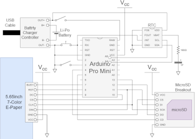

# ArduinoACePCalendar


This is a daily calendar using a color E-Paper display.

The screen is refreshed everyday with the image stored in the microSD card overlayed with today's date.

## Instruction

### Date & Time adjustment

First, you have to set date and time to RTC module.

A simple shell is available if the D3 pin is open, so you can control it through the serial interface with baud rate of 9600.

| Command |                                     |
|---------|-------------------------------------|
| NOW     | Show current date and time.         |
| DATE    | Set date by 8 digits (yyyymmdd).    |
| TIME    | Set time by 6 digits (HHMMSS).      |
| ALARM   | Set alarm time by 4 digits (HHMM).  |
| CLEAR   | Clear display with color (0-6).     |
| INDEX   | Set image index number (0-255).     |
| LOAD    | Load image data (0-255 or current). |
| EXAMINE | Examine function (0-3).             |
| HELP    | Show command help.                  |
| VERSION | Show version information.           |
| QUIT    | Quit shell.                         |

For example, enter command as follows to set January 16th 2022, 12:34:56.

```
ArduinoACePCalendar Shell
Version: X.XX (Xxx XX 20XX XX:XX:XX)

> date 20220116
OK
> time 123456
OK
> now
2022/1/16 12:35:03
> 
```

The screen is refreshed at 3:30 as default. If you'd like to change this 2:45, enter command as follows.

```
> alarm 0245
OK
> alarm
02:45
>
```

### Image conversion

Second, you have to convert the images to the particular format and save them to a microSD card.

As an image conversion tool, I produce a python script [`image2acp.py`](tools/image2acp.py).
To execute this script, you have to install not only [python 3.X](https://www.python.org/) but also [ImageMagick 7.X](https://imagemagick.org/script/index.php) because this script uses it.

You can obtain the file `sample1.acp` from `sample1.jpg` by entering following on console.

```
> python image2acp.py sample1.jpg
```

Then copy `*.acp` files into the root directory of a microSD card.

The order of images to display depends on the algorythm of file scanning in Arduino SD library. If all of `*.acp` files were displayed or 256th image was displayed, the first image will be desplayed again on the next day.

## Hardware

### Components

* [Arduino Pro Mini 328 - 3.3V/8MHz](https://www.sparkfun.com/products/11114) (or compatible product)
* [5.65inch 7-Color E-Paper module](https://www.waveshare.com/5.65inch-e-paper-module-f.htm)
* [RTC module](https://akizukidenshi.com/catalog/g/gK-13009/)
* [MicroSD breakout board](https://www.sparkfun.com/products/13743)
* [Battery charger controller module](https://www.aitendo.com/product/19267)
* A Li-Po battery
* A 180&ohm; resistor, a 1F electrolytic capacitor, a tactile switch and a slide switch (2 circuits)
* Connectors, wires, etc...

### Schematic

[](doc/schematic.png)


## Software 

### Build enviroment

You can build the source code by Arduino IDE with following configuration.

* Board: "Arduino Pro or Pro Mini"
* Processor: "ATmega328P (3.3V 8MHz)"

Then, you can transfer binary data to Arduino Pro Mini by any writer.

### License

These codes are licensed under [MIT License](LICENSE).

## References

* [5.65inch e-Paper Module (F) - Waveshare Wiki](https://www.waveshare.com/wiki/5.65inch_e-Paper_Module_(F))
* [RX8900SA RTC product information](https://www5.epsondevice.com/ja/products/rtc/rx8900sa.html)
* [SPI Connection with SD and LCD](http://sandglass888.livedoor.blog/archives/4084006.html)
