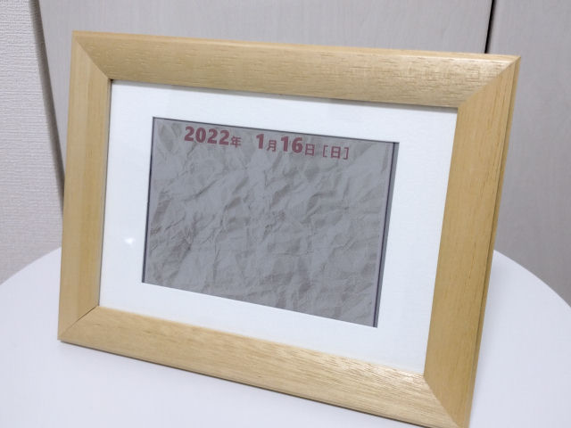

# ArduinoACePCalendar



カラー電子ペーパーを用いた日替わりカレンダーです。

一日一回、microSD カードに保存された画像に今日の日付を重ねたものを、画面に表示します。

## 使い方

### 日付と時刻の設定

始めに、RTC の日時合わせをしなければなりません。

D3 ピンがオープンであれば、電源投入時に簡単なシェルが動き出します。ボーレート 9600 のシリアル経由でコマンドを入力できます。

| コマンド |                                              |
|----------|----------------------------------------------|
| NOW      | 現在の日付と時刻を表示します                 |
| DATE     | 日時を8桁の数字で設定します (yyyymmdd)       |
| TIME     | 時刻を6桁の数字で設定します (HHMMSS)         |
| ALARM    | 画面更新の時刻を4桁の数字で設定します (HHMM) |
| CLEAR    | 画面を指定した色で消去します (0-6)           |
| INDEX    | 何番目の画像を表示するかを指定します (0-255) |
| LOAD     | 画面に画像を表示します (0-255 または 現在値) |
| EXAMINE  | 機能テストを行います (0-3)                   |
| HELP     | コマンドのヘルプを表示します                 |
| VERSION  | バージョン情報を表示します                   |
| QUIT     | シェルを終了します                           |

例えば、2022年1月16日 12時34分56秒に設定する場合は以下のように入力します。

```
ArduinoACePCalendar Shell
Version: X.XX (Xxx XX 20XX XX:XX:XX)

> date 20220116
OK
> time 123456
OK
> now
2022/1/16 12:35:03
> 
```

標準では毎朝3時30分に画面を更新します。これを2時45分に変えるには以下のように入力します。

```
> alarm 0245
OK
> alarm
02:45
>
```

### 画像データの変換

次に、画像を電子ペーパーで表示できる形式に変換し、microSD カードに保存する必要があります。

画像データ変換ツールとして、[python 3.X](https://www.python.org/) 用のスクリプト [`image2acp.py`](tools/image2acp.py) を用意しました。
スクリプトの中で [ImageMagick 7.X](https://imagemagick.org/script/index.php) を利用していますので、実行するには [python 3.X](https://www.python.org/) と併せて [ImageMagick 7.X](https://imagemagick.org/script/index.php) もインストールする必要があります。

実行環境が整ったら、コマンドラインから以下のように入力することで、`sample1.jpg` を変換したファイル `sample1.acp` を得ます。

```
> python image2acp.py sample1.jpg
```

このようにして得られる `*.acp` ファイルを microSD カードのルートディレクトリに保存してください。

カレンダーが表示する画像の順番は、Arduino の SD ライブラリが捜索する順番に従います。全ての `*.acp` ファイルを表示するか、256 番目まで表示したら、次回は再び最初の画像を表示します。

## ハードウェア情報

### 部品

* [Arduino Pro Mini 328 - 3.3V/8MHz](https://www.sparkfun.com/products/11114) (もしくは互換品)
* [5.65インチ 7色カラー電子ペーパー](https://www.waveshare.com/5.65inch-e-paper-module-f.htm)
* [RTC モジュール](https://akizukidenshi.com/catalog/g/gK-13009/)
* [MicroSD ブレイクアウトボード](https://www.sparkfun.com/products/13743)
* [充電昇圧一体化モジュール](https://www.aitendo.com/product/19267)
* Li-Po 充電池
* 抵抗 180&ohm;、電解コンデンサ 1F、タクトスイッチ、スライドスイッチ(2回路)
* コネクタ、線材、など

### 回路図

[](doc/schematic.png)


## ソフトウェア情報 

### ビルド環境

Arduino IDE で以下のように設定します。

* ボード: "Arduino Pro or Pro Mini"
* プロセッサ: "ATmega328P (3.3V 8MHz)"

あとは、お好みのライターを使用してスケッチを転送してください。

### ライセンス

これらのソースコードは [MIT ライセンス](LICENSE)で提供されます。

## 参考

* [5.65inch e-Paper Module (F) - Waveshare Wiki](https://www.waveshare.com/wiki/5.65inch_e-Paper_Module_(F))
* [RX8900SA リアルタイムクロック製品情報](https://www5.epsondevice.com/ja/products/rtc/rx8900sa.html)
* [SDとLCDでSPI接続 - 砂時計のblog](http://sandglass888.livedoor.blog/archives/4084006.html)
